# 文档编写规范

## 文档类型和目录结构

### 按功能模块组织
```
docs/
├── README.md                   # [项目] 文档入口，介绍项目并索引所有关键文档
├── project-requirements.md     # [项目] 定义整个项目的业务需求、目标和范围
├── getting-started.md          # [项目] 新成员的快速上手指南，包括环境搭建和启动
├── architecture.md             # [项目] 宏观架构设计，包括技术选型和系统分层
├── auth/                       # [模块] 认证功能
│   ├── README.md              # [模块] 认证模块的概述、功能范围和技术栈
│   ├── requirements.md         # [模块] 认证模块的详细用户故事、流程和验收标准
│   ├── design.md           # [模块] 认证模块的前端设计
├── user/                       # [模块] 用户功能
│   ├── README.md              # [模块] 用户模块的概述、功能范围和技术栈
│   ├── requirements.md         # [模块] 用户模块的详细用户故事、流程和验收标准
│   ├── design.md           # [模块] 用户模块的前端设计
└── shared/                     # [共享] 跨模块共享的资源
    ├── design-system.md        # [共享] UI设计规范，包括颜色、字体、组件库
    ├── testing-guide.md        # [共享] 项目的测试策略、规范和工具介绍
    └── deployment-guide.md     # [共享] 项目的构建、部署和发布流程指南
```

## 文档编写原则

### 通用原则
- **概念优先**：重点描述概念、流程和架构，而非具体实现
- **图表驱动**：使用流程图、架构图、表格等可视化方式表达
- **文字描述**：用清晰的文字描述功能、特性和使用方法
- **面向AI**：文档主要供AI助手阅读，使用清晰的结构和标准格式
- **完整性**：每个功能模块都应有完整的文档说明
- **可维护性**：文档结构清晰，便于更新和维护
- **前端导向**：如果没有特殊声明，那么文档应该专注于前端需求及前端设计

### 功能模块文档原则
- **完整性**：每个功能模块包含需求、设计、实现、测试的完整文档
- **一致性**：同一功能模块内的文档保持一致的格式和标准
- **可追溯性**：需求、设计、实现之间建立清晰的关联关系
- **可维护性**：文档结构清晰，便于更新和维护

### 文档类型原则
- **需求文档**：以用户视角描述功能需求和验收标准
- **设计文档**：描述界面设计、交互流程和用户体验
- **技术文档**：描述技术实现、API规范和组件使用
- **测试文档**：描述测试策略、用例和验收标准

## 文档表达方式优先级

### 1. 流程图 (Mermaid)
用于描述业务流程、数据流、组件交互等

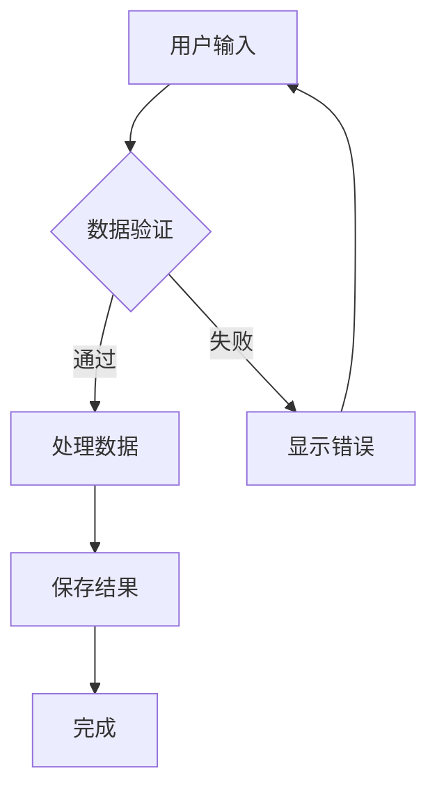

### 2. 架构图
用于描述系统架构、组件关系、数据流向

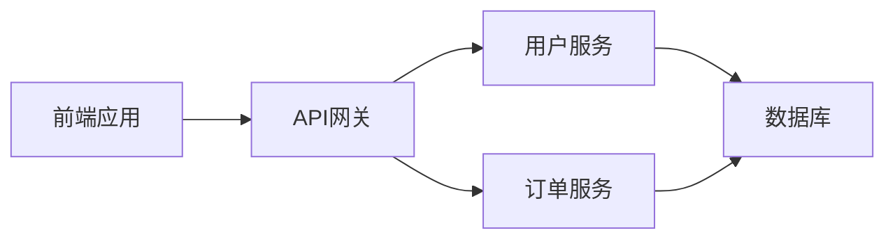

### 3. 表格
用于描述参数、配置、对比等结构化信息

| 参数名 | 类型 | 必填 | 默认值 | 说明 |
|--------|------|------|--------|------|
| userId | string | 是 | - | 用户唯一标识 |
| options | object | 否 | {} | 请求选项 |

### 4. 文字描述
用于描述概念、特性、注意事项等

## 组件文档规范

### 组件概述
用文字描述组件的用途、特性和适用场景

### 组件架构
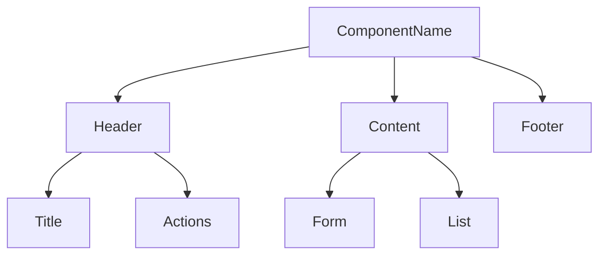

### 数据流
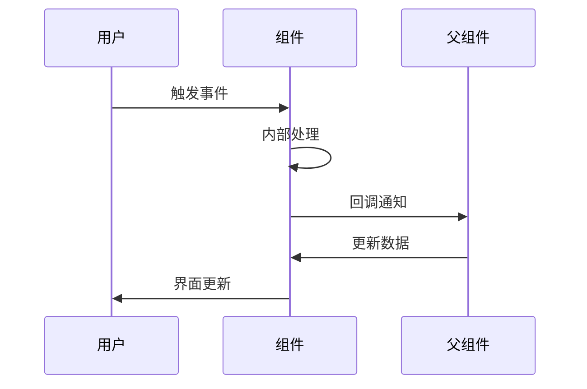

### 属性说明
| 属性名 | 类型 | 默认值 | 必填 | 说明 |
|--------|------|--------|------|------|
| data | object | - | 是 | 组件数据 |
| onSave | function | - | 否 | 保存回调 |

## API 文档规范

### API 概述
用文字描述API的功能、用途和特点

### 请求流程
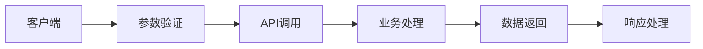

### 参数说明
| 参数名 | 类型 | 必填 | 默认值 | 说明 |
|--------|------|------|--------|------|
| userId | string | 是 | - | 用户ID |
| options | object | 否 | {} | 请求选项 |

### 响应格式
| 字段名 | 类型 | 说明 |
|--------|------|------|
| code | number | 响应状态码 |
| data | object | 响应数据 |
| message | string | 响应消息 |

## 类型文档规范

### 类型概述
用文字描述类型的作用、特点和约束

### 类型关系图
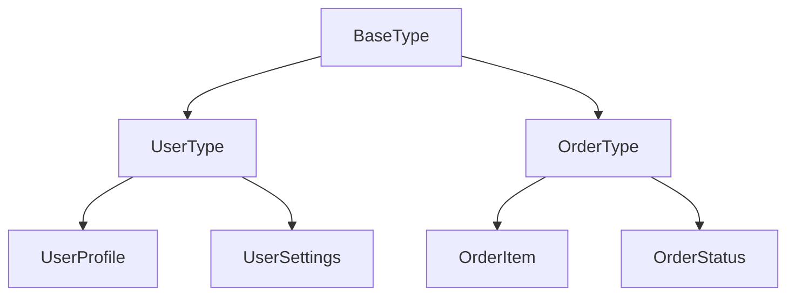

### 类型说明
| 类型名 | 用途 | 特点 | 约束 |
|--------|------|------|------|
| UserData | 用户数据 | 包含基本信息 | 必填字段验证 |
| OrderData | 订单数据 | 包含商品信息 | 状态流转验证 |

## 工具函数文档规范

### 函数概述
用文字描述函数的功能、输入输出和特点

### 处理流程
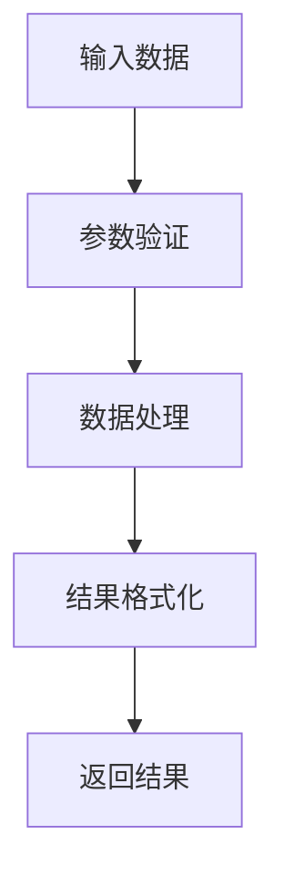

### 参数说明
| 参数名 | 类型 | 必填 | 说明 |
|--------|------|------|------|
| input | any | 是 | 输入数据 |
| options | object | 否 | 处理选项 |

## Hook 文档规范

### Hook 概述
用文字描述Hook的功能、状态管理和返回值

### 状态管理图
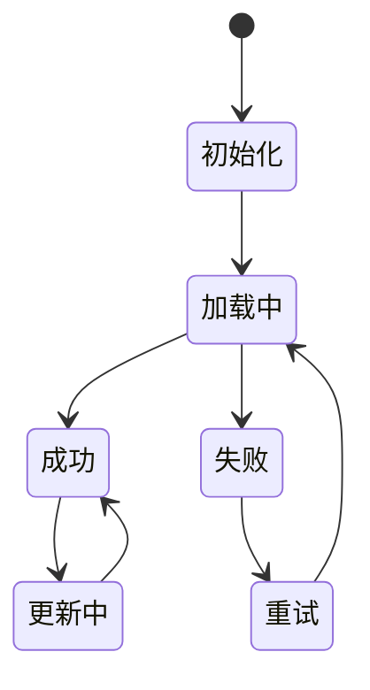

### 返回值说明
| 属性名 | 类型 | 说明 |
|--------|------|------|
| data | object | 数据对象 |
| loading | boolean | 加载状态 |
| error | string | 错误信息 |

## Markdown 文档编写规范

### 文档结构模板
```markdown
# 文档标题

## 概述
简要说明文档的目的和内容。

## 功能特性
- 特性1：详细说明
- 特性2：详细说明

## 架构设计
[使用Mermaid图表描述架构]

## 使用流程
[使用流程图描述使用步骤]

## 配置说明
[使用表格描述配置项]

## 注意事项
- 重要提醒1
- 重要提醒2

## 相关链接
- [相关文档1](link1)
- [相关文档2](link2)
```

### 文档编写要求
- **图表优先**：优先使用Mermaid图表描述流程和架构
- **表格清晰**：使用表格描述参数、配置等结构化信息
- **文字简洁**：用简洁明了的文字描述概念和特性
- **避免代码**：除非必要，避免在文档中展示具体代码实现
- **标题层级**：使用标准的Markdown标题层级（#, ##, ###）
- **链接有效**：使用相对路径或绝对路径，确保链接有效

### 文档更新规范
- 每次功能更新时同步更新相关文档
- 使用版本号标记文档更新
- 提供更新日志和变更说明
- 保持文档的时效性和准确性

## 文档质量检查清单

### 功能模块文档检查
- [ ] 模块概述清晰明确
- [ ] 功能范围完整列出
- [ ] 技术栈选择合理
- [ ] 相关文档链接完整
- [ ] 需求与技术实现可追溯

### 需求文档检查
- [ ] 用户故事清晰描述
- [ ] 功能流程图完整准确
- [ ] 验收标准具体可测试
- [ ] 异常场景考虑周全
- [ ] 技术约束明确说明

### 技术文档检查
- [ ] API接口规范清晰
- [ ] 组件使用说明详细
- [ ] 错误处理机制完善
- [ ] 安全考虑周全
- [ ] 性能优化建议合理

### 表达方式检查
- [ ] 优先使用图表而非代码
- [ ] 表格格式规范清晰
- [ ] 文字描述简洁明了
- [ ] 架构图完整准确
- [ ] 流程图逻辑清晰

### 可维护性检查
- [ ] 文档结构清晰
- [ ] 内容组织合理
- [ ] 便于后续更新
- [ ] 版本信息完整
- [ ] 需求与技术文档可追溯

## 文档模板示例

### 功能模块文档模板

#### 模块概述模板
```markdown
# 认证功能模块

## 模块概述
认证功能模块负责用户身份验证、授权管理和安全控制，是系统的核心安全组件。

## 功能范围
- 用户登录/登出
- 密码重置
- 记住登录状态
- 权限验证
- 会话管理

## 技术栈
- 前端：React + TypeScript
- 状态管理：Context API
- 请求库：ahooks useRequest
- 样式：Less Module

## 相关文档
- [需求文档](./requirements.md)
- [API文档](./api.md)
- [组件文档](./components.md)
- [线框图](./wireframes.md)
```

#### 需求文档模板
```markdown
# 认证功能需求

## 用户故事
### 用户登录
作为注册用户，我希望能够使用邮箱和密码登录系统，以便访问我的个人账户。

### 用户场景
#### 主要场景
1. 用户访问需要登录的页面
2. 系统重定向到登录页面
3. 用户输入邮箱和密码
4. 系统验证用户信息
5. 验证成功后跳转到原页面

#### 异常场景
- 用户输入错误的邮箱格式
- 用户输入错误的密码
- 网络连接失败
- 服务器响应超时

## 功能流程图
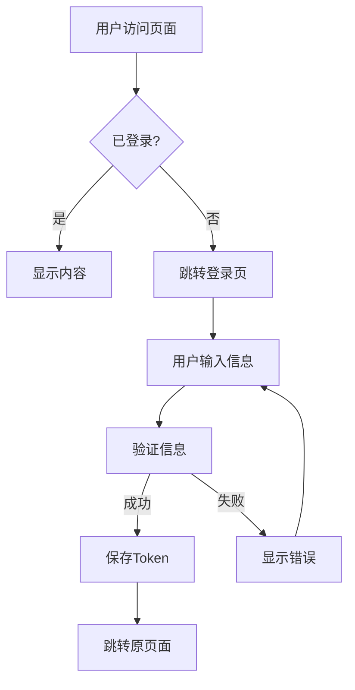

## 验收标准
| 功能点 | 验收标准 | 优先级 |
|--------|----------|--------|
| 登录验证 | 正确验证邮箱和密码 | 高 |
| 错误处理 | 显示明确的错误信息 | 高 |
| 记住登录 | 支持7天自动登录 | 中 |
| 安全退出 | 清除所有登录信息 | 中 |

## 技术约束
- 支持HTTPS传输
- Token过期时间30分钟
- 密码强度验证
- 防暴力破解机制
```

#### API文档模板
```markdown
# 认证API文档

## API概述
认证模块提供用户登录、登出、验证等核心API接口。

## 接口列表
| 接口名 | 方法 | 路径 | 说明 |
|--------|------|------|------|
| 用户登录 | POST | /api/auth/login | 用户身份验证 |
| 用户登出 | POST | /api/auth/logout | 清除登录状态 |
| 验证Token | GET | /api/auth/verify | 验证Token有效性 |

## 请求流程
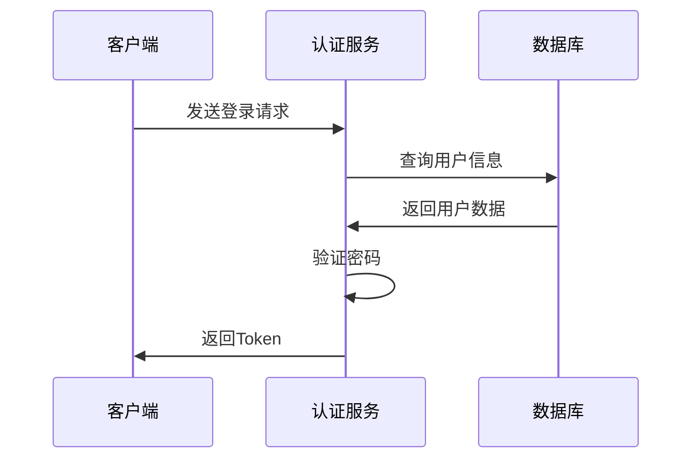

## 详细接口
### 用户登录
**请求参数**
| 参数名 | 类型 | 必填 | 说明 |
|--------|------|------|------|
| email | string | 是 | 用户邮箱 |
| password | string | 是 | 用户密码 |

**响应格式**
| 字段名 | 类型 | 说明 |
|--------|------|------|
| code | number | 响应状态码 |
| data | object | 用户信息和Token |
| message | string | 响应消息 |

## 错误码
| 错误码 | 说明 | 解决方案 |
|--------|------|----------|
| 400 | 参数错误 | 检查邮箱和密码格式 |
| 401 | 认证失败 | 检查用户名和密码 |
| 500 | 服务器错误 | 联系技术支持 |
```

#### 组件文档模板
```markdown
# 认证组件文档

## 组件概述
认证模块包含登录表单、注册表单、密码重置等核心组件。

## 组件架构
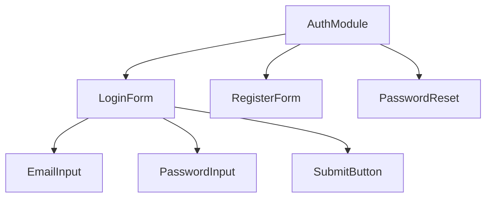

## 核心组件
### LoginForm 登录表单
**功能描述**
用户登录的主要界面组件，包含邮箱输入、密码输入和提交按钮。

**Props**
| 属性名 | 类型 | 默认值 | 必填 | 说明 |
|--------|------|--------|------|------|
| onSuccess | function | - | 是 | 登录成功回调 |
| onError | function | - | 否 | 登录失败回调 |
| loading | boolean | false | 否 | 加载状态 |

**使用示例**
```tsx
import { LoginForm } from '@/components/auth';

<LoginForm 
  onSuccess={(user) => console.log('登录成功', user)}
  onError={(error) => console.error('登录失败', error)}
/>
```

## 状态管理
认证状态通过 Context API 进行全局管理，提供以下功能：
- 用户信息存储
- 登录状态管理
- Token 自动刷新
- 权限验证

## 安全考虑
- 密码输入框使用 type="password"
- 表单提交使用 HTTPS
- Token 存储在 HttpOnly Cookie
- 支持 CSRF 防护
```

### 共享文档模板

#### 设计系统文档
```markdown
# 设计系统

## 设计原则
- 一致性：保持界面元素的一致性
- 可用性：确保界面易于使用
- 可访问性：支持无障碍访问
- 响应式：适配不同屏幕尺寸

## 颜色系统
| 颜色名称 | 色值 | 用途 |
|----------|------|------|
| Primary | #1890ff | 主要操作按钮 |
| Success | #52c41a | 成功状态 |
| Warning | #faad14 | 警告状态 |
| Error | #f5222d | 错误状态 |

## 组件库
### 基础组件
- Button：按钮组件
- Input：输入框组件
- Modal：模态框组件
- Table：表格组件

### 业务组件
- UserCard：用户卡片
- OrderList：订单列表
- ProductGrid：商品网格

## 使用指南
- 优先使用设计系统中的组件
- 保持颜色和间距的一致性
- 遵循响应式设计原则
```

#### 测试指南文档
```markdown
# 测试指南

## 测试策略
- 单元测试：使用 Vitest 测试工具函数
- 组件测试：使用 Storybook 测试组件
- 集成测试：测试模块间的交互
- E2E测试：测试完整的用户流程

## 测试规范
### 单元测试
- 测试覆盖率不低于 80%
- 重点测试业务逻辑
- 使用 Mock 数据隔离依赖

### 组件测试
- 测试组件渲染
- 测试用户交互
- 测试错误状态
- 测试边界条件

## 测试工具
- Vitest：单元测试框架
- Storybook：组件开发环境
- Testing Library：组件测试工具
- Mock Service Worker：API Mock

## 测试用例模板
```typescript
describe('ComponentName', () => {
  it('should render correctly', () => {
    // 测试渲染
  });
  
  it('should handle user interaction', () => {
    // 测试交互
  });
  
  it('should handle error states', () => {
    // 测试错误状态
  });
});
```
``` 