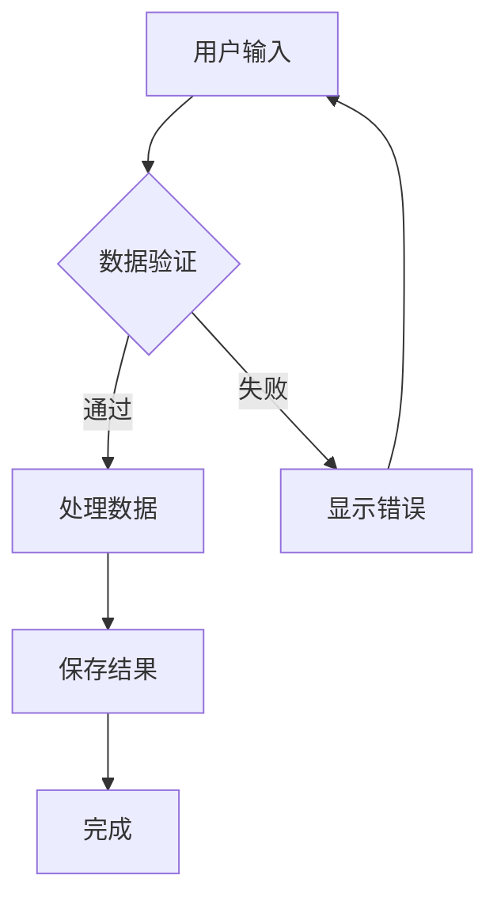
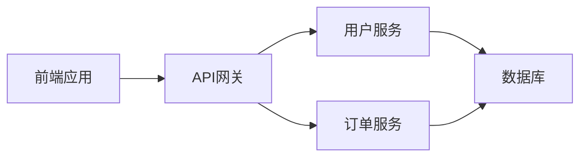
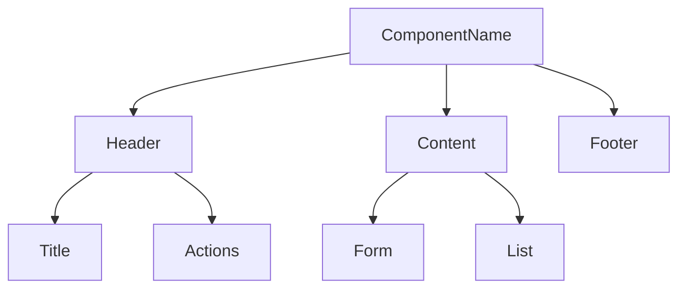
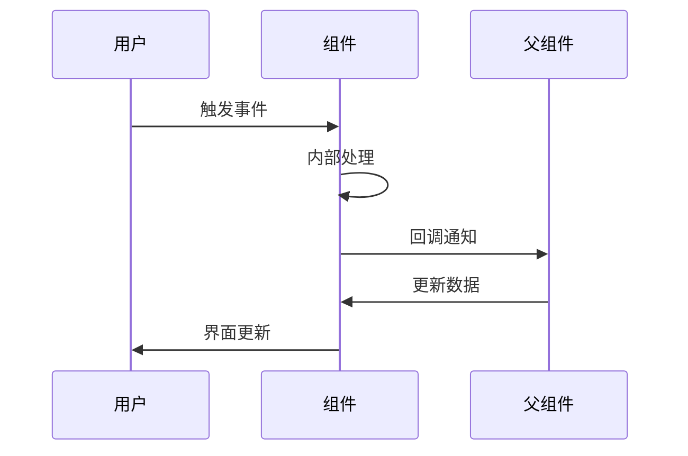
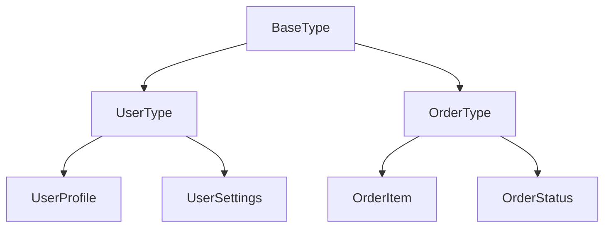
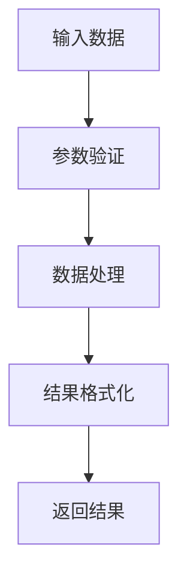
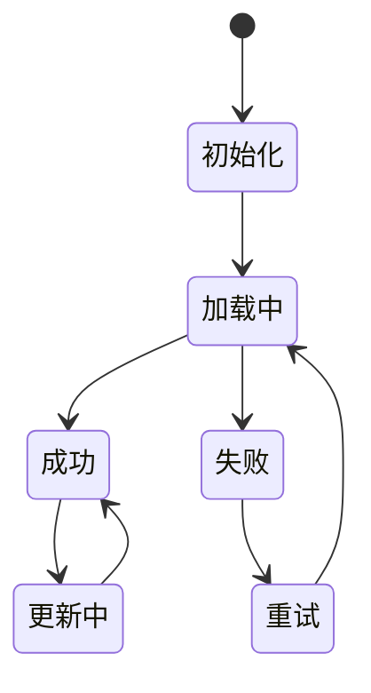
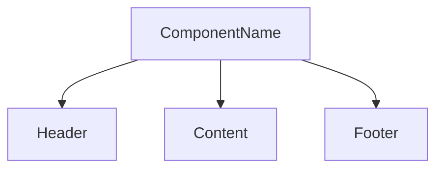
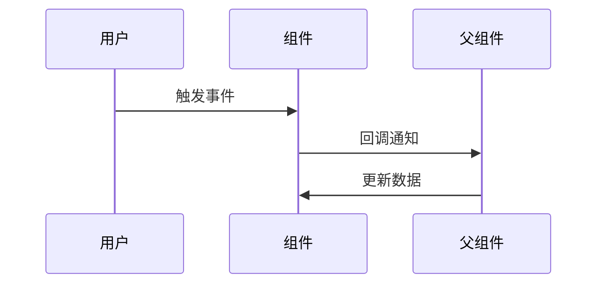

# 文档编写规范

## 文档类型和目录结构
```
docs/
├── README.md                    # 项目总体说明
├── getting-started.md           # 快速开始指南
├── architecture.md              # 架构设计文档
├── api/                         # API 文档
│   ├── user.md
│   └── auth.md
├── components/                  # 组件文档
│   ├── Button.md
│   └── UserProfile.md
├── guides/                      # 开发指南
│   ├── testing.md
│   └── deployment.md
└── design/                      # 设计文档
    ├── design-system.md
    └── ui-components.md
```

## 文档编写原则
- **概念优先**：重点描述概念、流程和架构，而非具体实现
- **图表驱动**：使用流程图、架构图、表格等可视化方式表达
- **文字描述**：用清晰的文字描述功能、特性和使用方法
- **面向AI**：文档主要供AI助手阅读，使用清晰的结构和标准格式
- **完整性**：每个功能模块都应有完整的文档说明
- **可维护性**：文档结构清晰，便于更新和维护

## 文档表达方式优先级

### 1. 流程图 (Mermaid)
用于描述业务流程、数据流、组件交互等



### 2. 架构图
用于描述系统架构、组件关系、数据流向



### 3. 表格
用于描述参数、配置、对比等结构化信息

| 参数名 | 类型 | 必填 | 默认值 | 说明 |
|--------|------|------|--------|------|
| userId | string | 是 | - | 用户唯一标识 |
| options | object | 否 | {} | 请求选项 |

### 4. 文字描述
用于描述概念、特性、注意事项等

## 组件文档规范

### 组件概述
用文字描述组件的用途、特性和适用场景

### 组件架构


### 数据流


### 属性说明
| 属性名 | 类型 | 默认值 | 必填 | 说明 |
|--------|------|--------|------|------|
| data | object | - | 是 | 组件数据 |
| onSave | function | - | 否 | 保存回调 |

## API 文档规范

### API 概述
用文字描述API的功能、用途和特点

### 请求流程


### 参数说明
| 参数名 | 类型 | 必填 | 默认值 | 说明 |
|--------|------|------|--------|------|
| userId | string | 是 | - | 用户ID |
| options | object | 否 | {} | 请求选项 |

### 响应格式
| 字段名 | 类型 | 说明 |
|--------|------|------|
| code | number | 响应状态码 |
| data | object | 响应数据 |
| message | string | 响应消息 |

## 类型文档规范

### 类型概述
用文字描述类型的作用、特点和约束

### 类型关系图


### 类型说明
| 类型名 | 用途 | 特点 | 约束 |
|--------|------|------|------|
| UserData | 用户数据 | 包含基本信息 | 必填字段验证 |
| OrderData | 订单数据 | 包含商品信息 | 状态流转验证 |

## 工具函数文档规范

### 函数概述
用文字描述函数的功能、输入输出和特点

### 处理流程


### 参数说明
| 参数名 | 类型 | 必填 | 说明 |
|--------|------|------|------|
| input | any | 是 | 输入数据 |
| options | object | 否 | 处理选项 |

## Hook 文档规范

### Hook 概述
用文字描述Hook的功能、状态管理和返回值

### 状态管理图


### 返回值说明
| 属性名 | 类型 | 说明 |
|--------|------|------|
| data | object | 数据对象 |
| loading | boolean | 加载状态 |
| error | string | 错误信息 |

## Markdown 文档编写规范

### 文档结构模板
```markdown
# 文档标题

## 概述
简要说明文档的目的和内容。

## 功能特性
- 特性1：详细说明
- 特性2：详细说明

## 架构设计
[使用Mermaid图表描述架构]

## 使用流程
[使用流程图描述使用步骤]

## 配置说明
[使用表格描述配置项]

## 注意事项
- 重要提醒1
- 重要提醒2

## 相关链接
- [相关文档1](link1)
- [相关文档2](link2)
```

### 文档编写要求
- **图表优先**：优先使用Mermaid图表描述流程和架构
- **表格清晰**：使用表格描述参数、配置等结构化信息
- **文字简洁**：用简洁明了的文字描述概念和特性
- **避免代码**：除非必要，避免在文档中展示具体代码实现
- **标题层级**：使用标准的Markdown标题层级（#, ##, ###）
- **链接有效**：使用相对路径或绝对路径，确保链接有效

### 文档更新规范
- 每次功能更新时同步更新相关文档
- 使用版本号标记文档更新
- 提供更新日志和变更说明
- 保持文档的时效性和准确性

## 文档质量检查清单

### 内容完整性
- [ ] 文档标题清晰明确
- [ ] 概述部分说明了文档目的
- [ ] 功能特性完整列出
- [ ] 使用流程图清晰描述
- [ ] 参数说明详细
- [ ] 注意事项和限制条件明确

### 表达方式
- [ ] 优先使用图表而非代码
- [ ] 表格格式规范清晰
- [ ] 文字描述简洁明了
- [ ] 架构图完整准确
- [ ] 流程图逻辑清晰

### 可维护性
- [ ] 文档结构清晰
- [ ] 内容组织合理
- [ ] 便于后续更新
- [ ] 版本信息完整

## 文档模板示例

### 组件文档模板
```markdown
# ComponentName 组件

## 概述
ComponentName 是一个用于...的 React 组件。

## 功能特性
- 特性1：支持...
- 特性2：提供...

## 组件架构


## 数据流


## API 参考

### Props
| 属性 | 类型 | 默认值 | 必填 | 说明 |
|------|------|--------|------|------|
| prop1 | string | - | 是 | 属性说明 |
| prop2 | number | 0 | 否 | 属性说明 |

### 事件
| 事件名 | 类型 | 说明 |
|--------|------|------|
| onChange | (value: string) => void | 值变化时触发 |

## 注意事项
- 注意事项1
- 注意事项2

## 相关链接
- [设计稿](link)
- [相关组件](link)
```

### API 文档模板
```markdown
# API 名称

## 概述
API 的功能描述和用途说明。

## 请求流程


## 参数说明
| 参数名 | 类型 | 必填 | 默认值 | 说明 |
|--------|------|------|--------|------|
| param1 | string | 是 | - | 参数说明 |

## 响应格式
| 字段名 | 类型 | 说明 |
|--------|------|------|
| code | number | 响应状态码 |
| data | object | 响应数据 |
| message | string | 响应消息 |

## 错误码
| 错误码 | 说明 | 解决方案 |
|--------|------|----------|
| 400 | 参数错误 | 检查参数格式 |
| 500 | 服务器错误 | 联系技术支持 |

## 注意事项
- 注意事项1
- 注意事项2
``` 